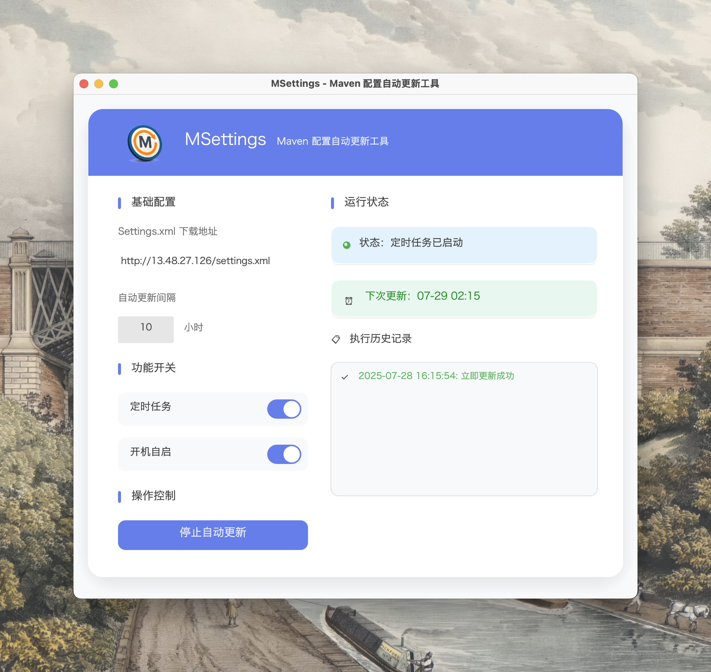

# MSettings - Maven 配置自动更新工具

一个现代化、苹果风格的 Maven settings.xml 自动更新工具。




## ✨ 新版本特性

### 🎨 现代化 UI 设计
- **苹果风格界面**: 采用现代简约设计，圆角、渐变、毛玻璃效果
- **直观的交互**: 精美的开关控件、状态指示器、动画效果
- **响应式布局**: 适配不同屏幕尺寸，窗口可调整大小
- **中文支持**: 内置中文字体，无乱码显示

### 🔧 功能增强
- **实时状态显示**: 可视化状态卡片，实时显示运行状态
- **手动更新**: 新增手动更新按钮，支持一键立即更新
- **历史记录**: 带图标的执行历史，成功/失败状态一目了然
- **错误处理**: 更友好的错误提示和状态反馈

### 🎯 用户体验优化
- **分段式布局**: 功能模块清晰分离，操作流程更直观
- **视觉反馈**: 按钮悬停效果、焦点状态、加载动画
- **智能提示**: 占位符文本、输入验证、操作指引

## 🚀 快速开始

### 环境要求
- Rust 1.70+
- 支持 macOS 10.12+ / Windows 10+

### 安装依赖
```bash
# 克隆项目
git clone <your-repo>
cd MSettings

# 安装 Rust 依赖
cargo build
```

### 字体配置
将中文字体文件放置在以下位置以确保界面正常显示：
```
assets/fonts/SourceHanSerifCN-Regular-1.otf
```

### 构建运行
```bash
# 开发模式运行
cargo run

# 构建 Release 版本
cargo build --release

# 使用构建脚本（推荐）
chmod +x build.sh
./build.sh
```

## 📱 界面预览

### 主界面功能区域

1. **头部区域**
    - 渐变色背景
    - 应用标题和描述

2. **基础配置**
    - Settings.xml 下载地址输入
    - 自动更新间隔设置（1-168小时）

3. **功能开关**
    - 定时任务开关（iOS 风格切换器）
    - 开机自启开关

4. **操作按钮**
    - 启动/停止自动更新（主按钮）
    - 手动更新一次（辅助按钮）

5. **状态显示**
    - 实时状态卡片
    - 动态状态指示器

6. **执行历史**
    - 可滚动历史记录列表
    - 成功/失败状态图标
    - 时间戳显示

## 🎨 设计特色

### 色彩系统
- **主色调**: 紫蓝渐变 (#667eea → #764ba2)
- **成功色**: 绿色 (#4caf50)
- **错误色**: 红色 (#f44336)
- **警告色**: 橙色 (#ff9800)

### 交互元素
- **圆角设计**: 12px-20px 统一圆角
- **渐变背景**: 多层次渐变效果
- **阴影效果**: 层次分明的投影
- **动画过渡**: 300ms 平滑过渡

### 响应式设计
- **最小宽度**: 480px
- **最大宽度**: 600px
- **窗口高度**: 600px-800px
- **自适应**: 内容区域自动调整

## 🔧 技术架构

### 核心技术栈
- **UI 框架**: egui 0.27
- **窗口管理**: eframe
- **网络请求**: reqwest
- **系统集成**: auto-launch
- **时间处理**: chrono

### 代码结构
```
src/
├── main.rs              # 主程序入口
├── ui/
│   ├── components.rs    # UI 组件
│   ├── styles.rs        # 样式定义
│   └── colors.rs        # 颜色常量
└── core/
    ├── downloader.rs    # 下载逻辑
    ├── scheduler.rs     # 定时任务
    └── config.rs        # 配置管理
```

## 📦 打包分发

### macOS
```bash
./build.sh
# 生成 MSettings.app 应用包
```

### Windows
```batch
build.bat
# 生成 MSettings.exe 可执行文件
```

### 分发包结构
```
dist/
├── MSettings.app/          # macOS 应用包
│   ├── Contents/
│   │   ├── MacOS/
│   │   │   └── AutoUpdateMavenSettings
│   │   ├── Resources/
│   │   │   └── assets/
│   │   └── Info.plist
└── MSettings/              # Windows 分发目录
    ├── AutoUpdateMavenSettings.exe
    └── assets/
```

## 🛠️ 自定义配置

### 修改默认配置
```rust
// main.rs 中的默认值
impl Default for AppState {
    fn default() -> Self {
        Self {
            interval_hours: 10,    // 默认间隔
            // ... 其他配置
        }
    }
}
```

### 自定义颜色主题
```rust
// 在 main.rs 中修改颜色常量
const PRIMARY_COLOR: Color32 = Color32::from_rgb(102, 126, 234);
const SECONDARY_COLOR: Color32 = Color32::from_rgb(118, 75, 162);
// ... 其他颜色
```

## 🐛 故障排除

### 常见问题

1. **中文显示乱码**
    - 确保字体文件路径正确：`assets/fonts/SourceHanSerifCN-Regular-1.otf`
    - 检查字体文件是否完整

2. **开机自启失败**
    - macOS: 检查系统安全设置
    - Windows: 以管理员权限运行

3. **网络下载失败**
    - 检查 URL 格式是否正确
    - 确认网络连接正常
    - 验证目标服务器可访问

4. **界面渲染异常**
    - 更新显卡驱动
    - 检查系统兼容性

### 调试模式
```bash
# 启用详细日志
RUST_LOG=debug cargo run
```

## 🤝 贡献指南

欢迎提交 Issue 和 Pull Request！

### 开发环境设置
1. Fork 项目
2. 创建功能分支
3. 提交更改
4. 发起 Pull Request

### 代码规范
- 使用 `cargo fmt` 格式化代码
- 运行 `cargo clippy` 检查代码质量
- 添加适当的注释和文档

## 📄 许可证

MIT License - 详见 [LICENSE](LICENSE) 文件

## 📞 联系方式

- 项目主页: [GitHub Repository]
- 问题反馈: [Issues]
- 功能建议: [Discussions]

---

**享受现代化的 Maven 配置管理体验！** 🎉